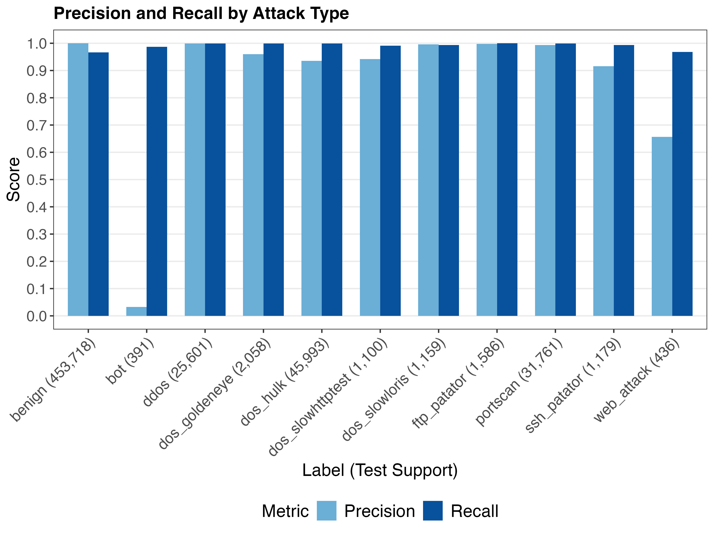
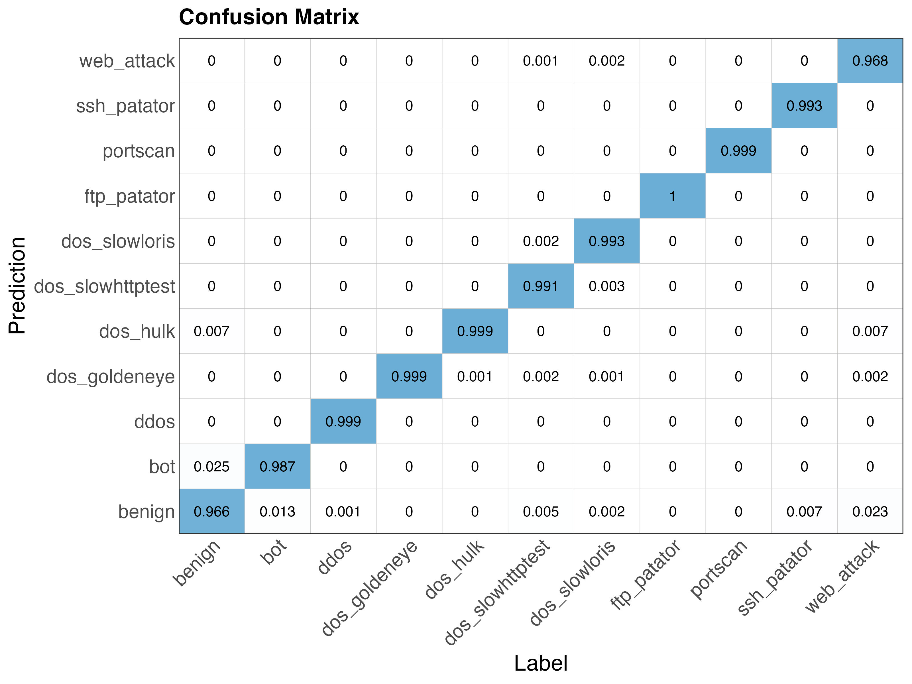

# Network Intrusion Detection with CIC-IDS-2017

## Overview
This project builds machine learning models for network intrusion detection. The data consist of network flows generated by the [Canadian Institute of Cybersecurity](https://www.unb.ca/cic) for the CIC-IDS-2017 benchmark dataset (see [data/README.md](data/README.md) for details). The models classify flows as normal/benign or a type of attack.

## Model Performance
We aimed to train a multi-class model with the ability to detect any one of 13 classes (benign or one of 12 attack types). A random forest model achieved recall >0.97 on 12 classes.

<p align = 'center'>

</p>

We emphasized recall (probability of classifying a flow that is actually an attack as an attack) over precision (probability that a flow classified as an attack is actually an attack) so that more attacks would be detected. The practical tradeoff is that security analysts will spend additional time on false positives, but this is preferable to missing an attack.

There was extremely limited test support for two attack types (heartbleed, n=1) as well as infiltration (n=7), making results for these types unreliable. Additionally, while the model had excellent recall on bot attacks, it had extremely poor precision. Bot attacks are disguised to appear benign and may be harder to distinguish with network flows (Layer 4 data) than with application data (Layer 7 data).

Below is the confusion matrix for the test data with rows normalized by column sums so that the diagonal shows recall by attack type. We see that poorer recall on the small number of infiltration flows was due to incorrect classification of these flows as benign. However, given limited test support, infiltration results are unreliable.

<p align = 'center'>

</p>

Note that we have combined three types of web attacks, including SQLi and XSS, given limited support. Like with bot attacks, network flows associated with web attacks are challenging to distinguish from benign flows. While performance on the combined attack type was reasonable, web attacks are better detected through application data (Layer 7 data).

## Feature Engineering
We dropped several redundant and zero-variance features from the CIC-IDS-2017 dataset. We also replaced `destination_port` with three indicator variables: `is_ftp`, `is_http`, and `is_ssh` based on the attack types in the dataset. This was done using the function `indicate_service()` in [`src/processing.py`](src/processing.py). A small number of relevant indicator variables was preferable to encoding every port, some of which may vary between the training data and applied settings.

## Class Imbalance
A major challenge in security data science is class imbalance. The vast majority of these samples were labeled benign, and the samples labeled malicious were distributed among 12 attack types. We considered both SMOTE and class weights for this problem, finding similar performance between the two and using class weights as the more realistic choice in the security domain since weights would allow a security team to focus detection based on a particular threat model. 

## Getting Started
### Install the Project

```bash
# Clone repo
git clone https://github.com/tylerjssmith/cic-ids-2017.git

# Enter repo
cd cic-ids-2017

# If necessary, create environment and install requirements.
# > conda create --name cic-ids-2017 python
# > conda activate cic-ids-2017
# > pip install -r requirements.txt
```

### Download Data
The raw data need to be downloaded to `data/raw/`. The training pipeline will process the data and save them to `data/processed`. See [data/README.md](data/README.md) for how to obtain the raw data.

### Train and Test Models
The package trains candidate models following a configuration file (see [config/](config/)). This file specifies a series of processing and training functions found in [src/](src/). The configuration file also specifies candidate models (model classes and hyperparameters). The trained models and cross-validation results are saved together as a .pkl file.

```bash
# Train candidate models
bash scripts/train_models.sh config/train_weights.yml
```

The trained models in the .pkl file are evaluated on test data.

```bash
# Evaluate candidate models on test data
bash scripts/evaluate_models.sh \
    --results models/results.pkl \
    --data data/processed/
```

### Finalize Model
A chosen model from the .pkl file is finalized by retraining it on the full data. The final model is saved as a .skops file for deployment. A compressed copy of the model described above is available at [`models/final.skops.zip`](models/final.skops.zip).
```bash
# Finalize model
bash scripts/finalize_model.sh \
    --results models/results.pkl \
    --model random_forest \
    --data data/processed/ \
    --output models/final.skops

```

## Next Steps
While recall was the priority, precision was low on bot attacks. The practical consequence is that security analysts would need to spend more time reviewing false positives for these attacks. It should be possible to improve precision for bot attacks, especially with the addition of Layer 7 data.