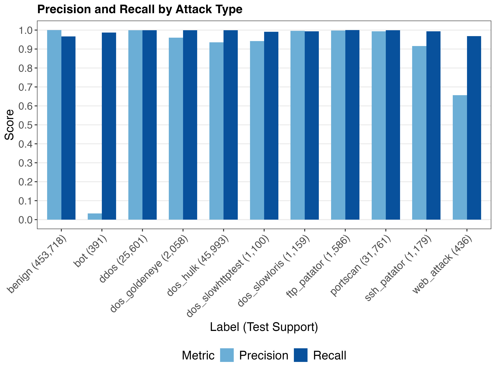
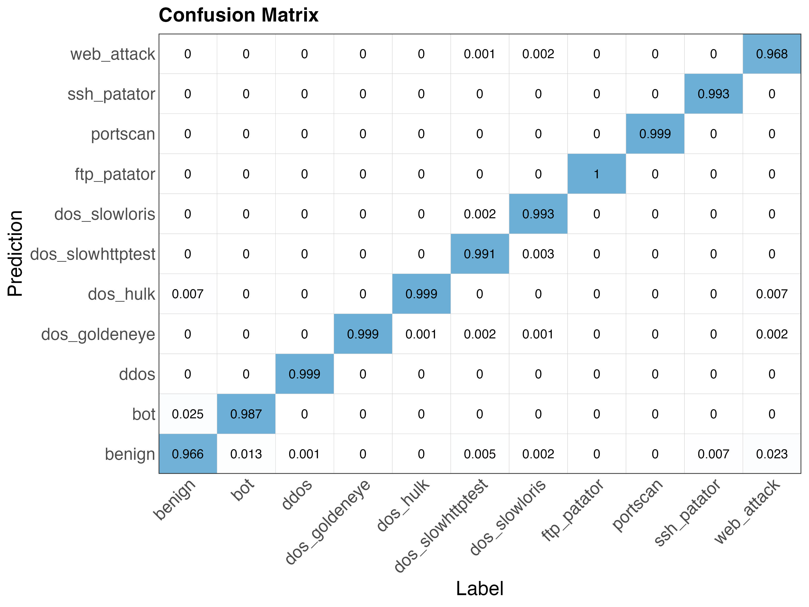

# Network Intrusion Detection with CIC-IDS-2017

## Overview
This project builds machine learning models for network intrusion detection. The data consist of network flows generated by the [Canadian Institute of Cybersecurity](https://www.unb.ca/cic) for the CIC-IDS-2017 benchmark dataset (see [data/README.md](data/README.md) for details). The models classify flows as normal/benign or a type of attack.

## Model Performance
We aimed to train a multi-class model with the ability to detect any one of 11 classes (benign or one of 10 attack types). A random forest model achieved recall >0.96 on all classes, including recall >0.99 on eight classes.

<p align = 'center'>

</p>

We emphasized recall (probability of classifying a flow that is actually an attack as an attack) over precision (probability that a flow classified as an attack is actually an attack) so that more attacks would be detected. The practical tradeoff is that security analysts will spend additional time on false positives. This could be tuned to reduce alert fatigue.

While the model had excellent recall (0.9872) on bot attacks, it had extremely poor precision (0.0325). Bot attacks are disguised to appear benign and may be harder to distinguish with network flows (Layer 4 data) than with application data (Layer 7 data). Below is the confusion matrix with rows normalized by column sums so that the diagonal shows recall by attack type. We see that errors on bot flows typically we misclassifications as benign.

<p align = 'center'>

</p>

## Attack Types
As published, CIC-IDS-2017 includes 15 classes. We dropped two attack types -- Heartbleed and Infiltration -- with extremely low support because results would be unreliable. We also combined three types of web attacks, including SQLi and XSS, given limited support. Like with bot attacks, network flows associated with web attacks are more challenging to distinguish from benign flows. While performance on the combined attack type was reasonable, web attacks are better detected through application data (Layer 7 data).

## Feature Engineering
We dropped several redundant and zero-variance features from the CIC-IDS-2017 dataset. We also replaced `destination_port` with three indicator variables: `is_ftp`, `is_http`, and `is_ssh` based on the attack types in the dataset. This was done using the function `indicate_service()` in [`src/data/build_features.py`](src/data/build_features.py.py). A small number of relevant indicator variables was preferable to encoding every port, some of which may vary between the training data and applied settings.

## Class Imbalance
A major challenge in security data science is class imbalance. The vast majority of these samples were labeled benign, and the samples labeled malicious were distributed among 10 classes. We considered both SMOTE and class weights for this problem, finding similar performance between the two and preferring class weights as the more realistic choice for two reasons. First, the class imbalance is real and the models should reflect this reality. Second, weights allow a security team to focus detection based on a particular threat model and risk assessment.

## Getting Started
### Install the Project

```bash
git clone https://github.com/tylerjssmith/cic-ids-2017.git
cd cic-ids-2017
```

If necessary, create a conda environment (or use venv) and install requirements.

```bash
conda create --name cic-ids-2017 python
conda activate cic-ids-2017
pip install -r requirements.txt
```

### Download Data
The raw data need to be downloaded to `data/raw/`. The training pipeline will process the data and save them to `data/processed`. See [data/README.md](data/README.md) for how to obtain the raw data.

### Process Data
A pipeline runner ([src/pipeline.py](src/pipeline.py)) is used to orchestrate each phase of the machine learning lifecycle, following a configuration file. Raw data are processed by [config/data.yml](config/data.yml) with processed data splits saved to `data/processed/`.

```bash
python3 src/pipeline.py --config config/data.yml
```

### Train Models
The data splits are loaded and piped into [train_models()](src/models/train.py). The model artifacts and metadata are saved as .pkl files in [models/](models/).

```bash
python3 src/pipeline.py --config config/train_smote.yml
python3 src/pipeline.py --config config/train_weights.yml
```

### Test Models
The data splits and results files are loaded and piped into [evaluate_models()](src/models/evaluate.py). Results are saved as .pkl files in [models/](models/).

```bash
python3 src/pipeline.py --config config/evaluate_smote.yml
python3 src/pipeline.py --config config/evaluate_weights.yml
```

### Finalize Model
A chosen model from the .pkl file is finalized by retraining it on the full data using [finalize_model()](src/models/finalize.py). The final model is saved as a compressed .skops file for deployment.

`finalize_model()` includes a smoke test to confirm the model will serve predictions and saves a SHA-256 hash file alongside the model to verify model integrity prior to deployment.

```bash
python3 src/pipeline.py --config config/finalize_model.yml
```

## Next Steps
While recall was the priority, precision was poor on bot attacks. The practical consequence is that security analysts would need to spend more time reviewing false positives for these attacks. It should be possible to improve precision for bot attacks, especially with the addition of Layer 7 data.

A future version will include probability calibration and threshold tuning, with a function to select per-class thresholds by specifying a minimum precision and maximizing recall subject to that constraint. This would allow users to explicitly control the precision-recall tradeoff for each attack type based on their threat model and analyst capacity.